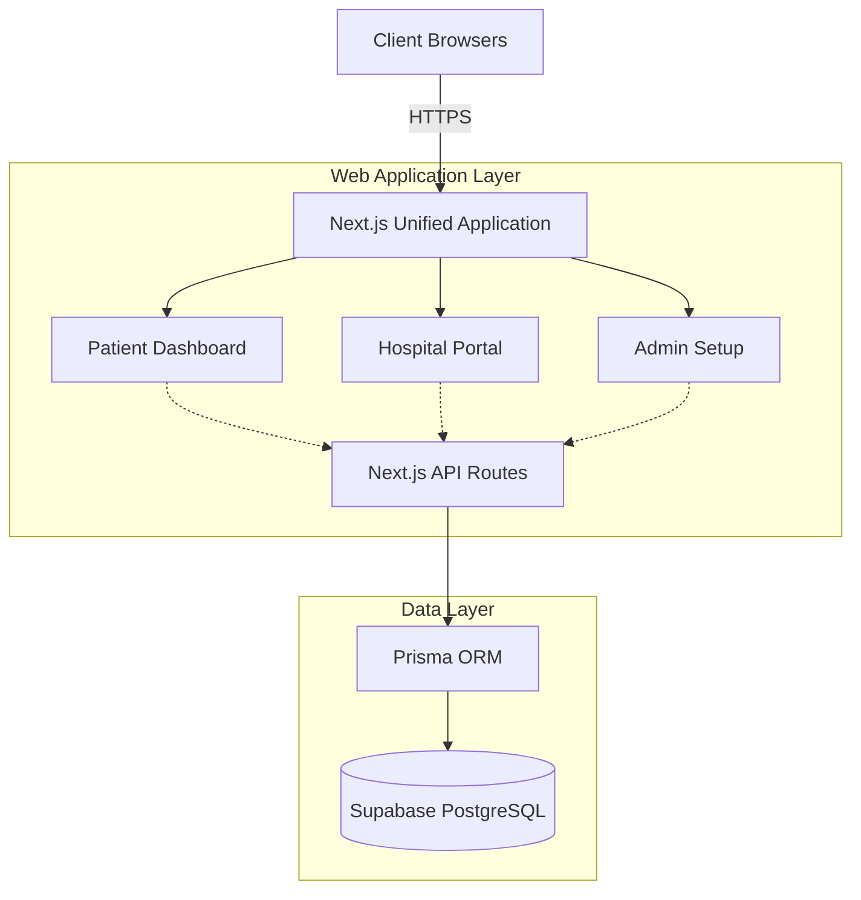

# ResQ Platform

A next-generation emergency intelligence platform designed to seamlessly connect patients, hospitals, and dispatchers in real-time.

## Architecture

The system is built as a unified Next.js web application encompassing multiple distinct user portals, powered by serverless API routes and a centralized PostgreSQL database.



## Core Features

- Patient Triage System: Instant geolocation and medical profile transmission for rapid emergency response.
- Hospital Dashboard: Real-time emergency monitoring, patient vitals tracking, and ambulance dispatch management.
- Admin Infrastructure: Centralized hospital onboarding, database seeding, and system configuration.
- Secure Authentication: Stateless, serverless-compatible OTP verification via email for secure login sessions.

## Technology Stack

- Framework: Next.js 14
- Database: Supabase PostgreSQL
- ORM: Prisma
- Styling: Tailwind CSS
- Email/Auth: Nodemailer (SMTP)

## Environment Configuration

The following environment variables are required for deployment:

- `DATABASE_URL`: Connection string for the PostgreSQL database (transaction pooling).
- `DIRECT_URL`: Direct connection string for Prisma migrations.
- `GMAIL_USER`: SMTP email address for sending authentication OTPs.
- `GMAIL_APP_PASSWORD`: 16-character Google App Password.

## Local Development

1. Install dependencies:
   ```bash
   npm install
   ```

2. Generate Prisma Client:
   ```bash
   npx prisma generate
   ```

3. Start the development server:
   ```bash
   npm run dev
   ```

## Deployment

This application is optimized for Vercel. Ensure all environment variables are provided in the Vercel project settings prior to deployment. The application utilizes stateless cookies for authentication, ensuring seamless compatibility with Vercel's Serverless Functions.
